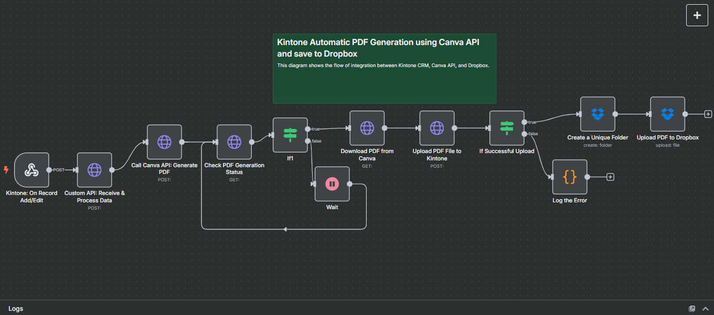
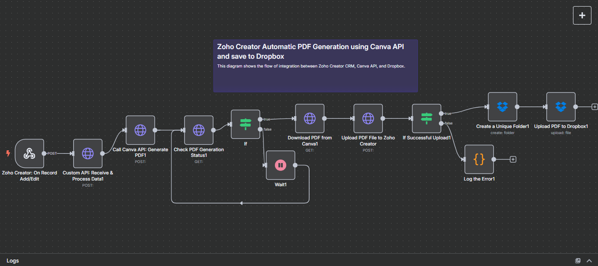
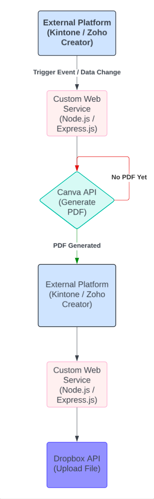

# Gogo-PDFGenerator-Service 🔌
A custom web service built for automating PDF generation from data coming in external online platforms such as Kintone or Zoho Creator.

## 💡 Overview
**Gogo-PDFGenerator-Service** automates the generation of PDF documents filled with data collected from platforms such as **[Kintone](https://www.kintone.com/)** or **[Zoho Creator](https://www.zoho.com/creator/)**.

It utilizes:  
- The **[Canva Connect API](https://www.canva.dev/docs/connect/)** to auto-fill and generate PDFs based on pre-designed templates via the *Bulk Create* feature.  
- The **[Dropbox API](https://www.dropbox.com/developers/documentation/http/overview)** to store PDF files in a secure and accessible cloud location.

This custom web service built in **Node.js** acts as the orchestration layer, enabling seamless communication between systems.

 

The diagram below shows the automation process starting from the business platform (Kintone or Zoho Creator), passing through the custom service, and ending with file storage:

### Kintone -> Canva -> Dropbox 

### Zoho Creator -> Canva -> Dropbox 

 

## 🔀 Integration Flow

  

This diagram shows how data from Kintone or Zoho Creator triggers the custom web service to generate a PDF via Canva.  
If successful, the PDF is returned to the platform, then passed back to the service for upload to Dropbox.

 

## 🖥️ Technologies Used
- Node.js
- Express.js
- Canva Connect API
- Dropbox API
- JSON Webhook / REST API

 

## 📌 Usage
1. A user adds or updates a record in Kintone or Zoho Creator.
2. The business app sends data to this custom service.
3. The service uses the Canva API to generate a PDF based on the submitted data.
4. The resulting file is returned to the platform for preview.
5. Once approved, another API call to this service can be triggered to save the PDF file permanently to Dropbox.
